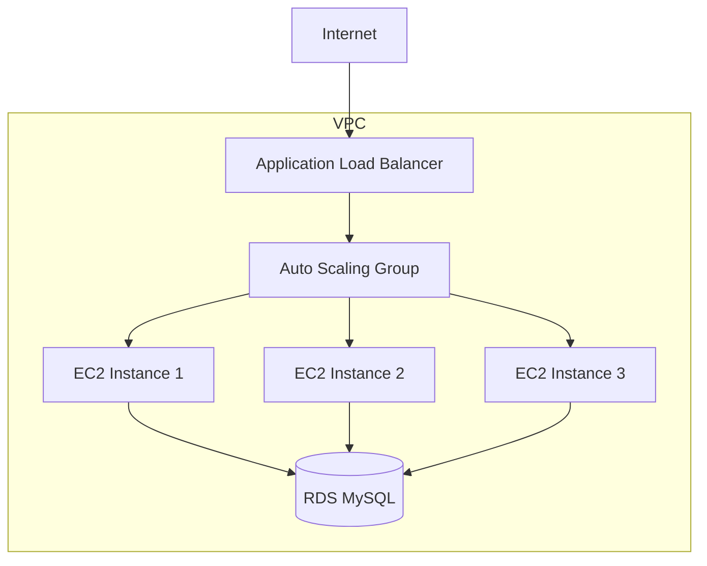

# AWS Auto Scaling Lab - Infrastructure as Code

## Tổng quan
Dự án này là một ví dụ thực tế về việc triển khai cơ sở hạ tầng trên AWS sử dụng Infrastructure as Code (IaC) thông qua Terraform. Dự án tập trung vào việc xây dựng một hệ thống có khả năng tự động mở rộng (Auto Scaling) với các thành phần cơ bản của một ứng dụng web hiện đại.

Để xem bài lab gốc, bạn có thể truy cập [FCJ Management Demo](https://000006.awsstudygroup.com/5-test/).

## Ý nghĩa đối với người mới học AWS
- Hiểu được cách triển khai và quản lý cơ sở hạ tầng trên AWS thông qua code
- Học cách thiết kế và triển khai một hệ thống có khả năng mở rộng
- Thực hành với các dịch vụ AWS cơ bản như EC2, RDS, VPC, Auto Scaling
- Hiểu về bảo mật và networking trong AWS
- Làm quen với khái niệm Infrastructure as Code

## Kiến trúc hệ thống



### Các thành phần chính và tương tác
1. **VPC và Networking**
   - VPC với CIDR block 10.0.0.0/16
   - 3 public subnets cho các tài nguyên cần truy cập internet
   - 3 private subnets cho database
   - Internet Gateway cho kết nối internet
   - Route tables cho điều hướng traffic

2. **Application Layer**
   - Application Load Balancer (ALB) để phân phối traffic
   - Auto Scaling Group (ASG) quản lý 1-3 EC2 instances
   - EC2 instances chạy ứng dụng web trên port 5000

3. **Database Layer**
   - RDS MySQL instance trong private subnet
   - Security group cho phép kết nối từ EC2 instances
   - Subnet group cho high availability

## Công nghệ sử dụng
- **Infrastructure as Code**: Terraform
- **Cloud Provider**: AWS
- **Compute**: EC2 (t2.micro)
- **Database**: RDS MySQL
- **Networking**: VPC, Subnets, Security Groups
- **Load Balancing**: Application Load Balancer
- **Auto Scaling**: Auto Scaling Group
- **Monitoring**: CloudWatch (thông qua Auto Scaling metrics)

## Yêu cầu và cài đặt

### Prerequisites
1. AWS Account với quyền truy cập đầy đủ
2. AWS CLI đã được cài đặt và cấu hình
3. Terraform CLI (version >= 1.0.0)
4. SSH key pair đã được tạo trong AWS

### Cấu hình cần thiết
1. Tạo file `.env` với các biến môi trường:
   ```
   AWS_ACCESS_KEY_ID=your_access_key
   AWS_SECRET_ACCESS_KEY=your_secret_key
   ```

2. Tạo file `dev.tfvars` với các biến Terraform:
   ```
   db_password=your_db_password
   ```

3. Đảm bảo có key pair tên "fcj" trong AWS region ap-southeast-1

### Triển khai
1. Khởi tạo Terraform:
   ```bash
   terraform init
   ```

2. Kiểm tra kế hoạch triển khai:
   ```bash
   terraform plan -var-file="dev.tfvars"
   ```

3. Triển khai infrastructure:
   ```bash
   terraform apply -var-file="dev.tfvars"
   ```

### Lưu ý
- Đảm bảo bảo mật các thông tin nhạy cảm (credentials, passwords)
- Kiểm tra security groups và network ACLs trước khi triển khai
- Backup dữ liệu quan trọng trước khi thực hiện các thay đổi lớn
- Theo dõi chi phí AWS để tránh phát sinh không mong muốn